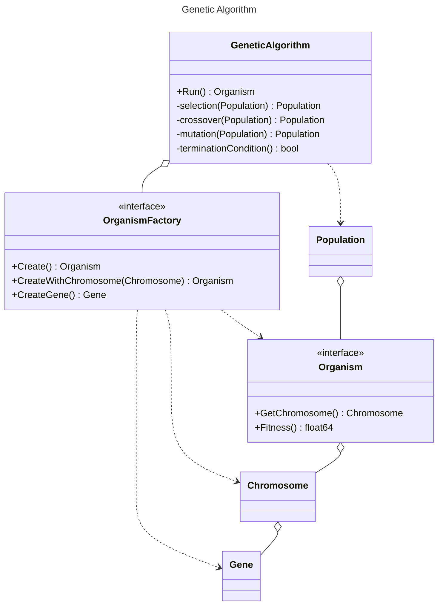

# Genetic Algorithm

## Install

```bash
go get github.com/adrian-lin-1-0-0/go-genetic-algorithme
```

## Class Diagram

Factory Method



## Example

```go
package main

import (
	"fmt"
	"math/rand"

	ga "github.com/adrian-lin-1-0-0/go-genetic-algorithme"
)

func main() {

	gaOpts := (&ga.GeneticAlgorithmOptions{}).
		SetMaxGeneration(100).
		SetMutationRate(0.01).
		SetPopulationSize(2000).
		SetOrganismFactory(&OrganismFactory{}).
		SetFitnessThreshold(19)

	geneticAlgorithm := ga.NewGeneticAlgorithm(gaOpts)
	res := geneticAlgorithm.Run()
	fmt.Println(string(res.GetChromosome()))
	//to be or not to be
}

type Organism struct {
	chromosome ga.Chromosome
	fitness    float64
}

func (o Organism) GetChromosome() ga.Chromosome {
	return o.chromosome
}

func (o Organism) Fitness() float64 {
	if o.fitness != 0 {
		return o.fitness
	}
	target := []rune("to be or not to be")
	chromosome := o.chromosome
	fitness := 0.0
	for i, gene := range chromosome {
		if gene == ga.Gene(target[i]) {
			fitness++
		}
	}
	fitness++
	o.fitness = fitness
	return o.fitness
}

type OrganismFactory struct {
}

func (o *OrganismFactory) Create() ga.Organism {
	charRange := []rune("abcdefghijklmnopqrstuvwxyz ")

	chromosome := make(ga.Chromosome, 18)
	for i := 0; i < 18; i++ {
		chromosome[i] = ga.Gene(charRange[rand.Intn(len(charRange))])
	}
	return Organism{chromosome, 0}
}

func (o *OrganismFactory) CreateWithChromosome(chromosome ga.Chromosome) ga.Organism {
	return Organism{chromosome, 0}
}

func (o *OrganismFactory) CreateGene() ga.Gene {
	charRange := []rune("abcdefghijklmnopqrstuvwxyz ")

	return ga.Gene(charRange[rand.Intn(len(charRange))])
}

```
