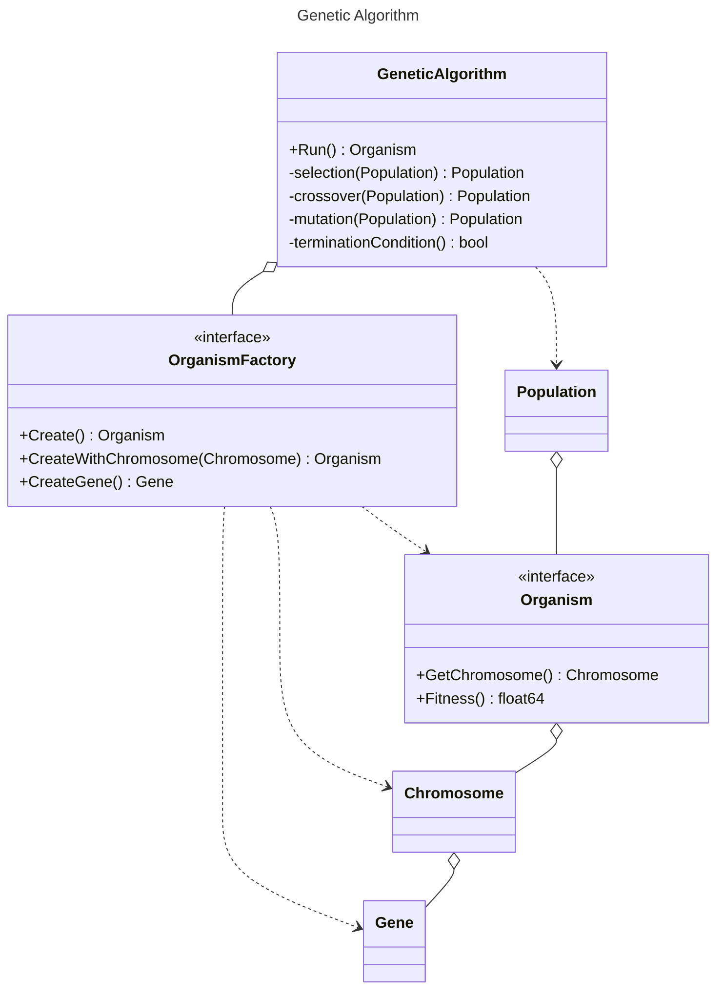

# Genetic Algorithm

## Example

```sh
go run ./examples/main.go

to be or not to be
```

## Class Diagram

Factory Pattern


```mermaid
---
title: Genetic Algorithm
---
classDiagram
    class Organism{
        <<interface>>
        +GetChromosome() Chromosome
        +Fitness() float64
    }

    class Chromosome{
    }

    
    class Gene{
    }

    class OrganismFactory{
        <<interface>>
        +Create() Organism
        +CreateWithChromosome(Chromosome) Organism
        +CreateGene() Gene
    }


    
    Organism o-- Chromosome
    Chromosome o-- Gene
    OrganismFactory ..> Gene
    OrganismFactory ..> Chromosome
    OrganismFactory ..> Organism

    class Population{

    }

    class GeneticAlgorithm{
        +Run() Organism
        -selection(Population)Population
        -crossover(Population)Population
        -mutation(Population)Population
        -terminationCondition()bool
    }

    GeneticAlgorithm o-- OrganismFactory
    GeneticAlgorithm ..> Population
    Population o-- Organism


```
